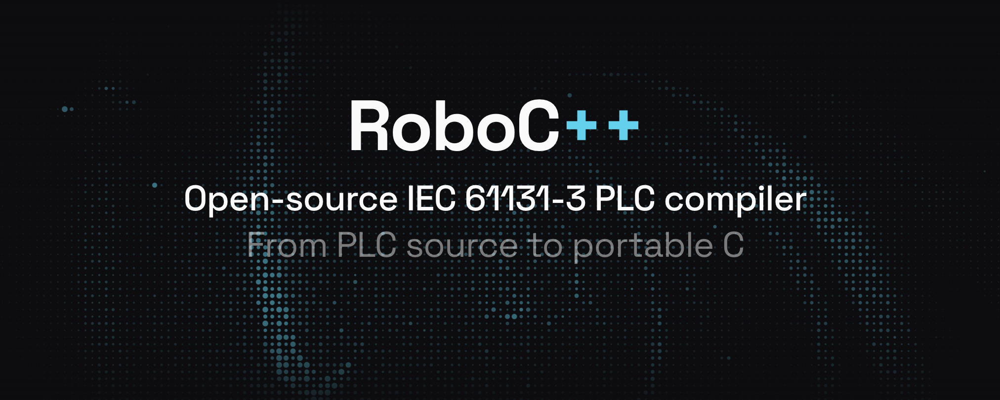

# RoboC++

RoboC++ is an open-source IEC 61131-3:2003 compiler and runtime toolkit for
building PLC-style and robot-control systems in Rust and portable C. It is aimed
at builders, robotics teams, controls engineers, and enterprises that need a
reviewable toolchain they can run, test, integrate, and extend without being
locked into a vendor IDE.

The current compiler profile covers Structured Text, Instruction List, textual
SFC, native textual Ladder Diagram, native textual Function Block Diagram,
configurations, resources, tasks, access paths, PLCopen XML exchange,
deterministic interpretation, and generated C.

Start with the CLI:

```sh
rbcpp check examples/counter.st
rbcpp check examples/instruction_list.il
rbcpp check examples/sequence.sfc
rbcpp check examples/native_ladder.ld
rbcpp check examples/native_fbd.fbd
rbcpp check examples/plcopen_ld.xml
rbcpp run examples/counter.st --cycles 3
rbcpp run examples/configuration.st --cycles 2 --configuration Plant
rbcpp build-c examples/counter.st -o build/counter.c
rbcpp import-plcopen examples/plcopen_fbd.xml
rbcpp export-plcopen examples/counter.st -o build/project.xml
rbcpp compliance
rbcpp todos
rbcpp parameters
```

The implementation is intentionally dependency-light: the core crates use the
Rust standard library so the architecture is easy to audit, vendor, port, and
embed.

## What It Provides

- IEC 61131-3:2003 language compiler complete for the repository's current
  `2003-strict` profile.
- Deterministic scan-cycle interpreter for quick simulation and trace output.
- Portable generated C backend for embedding scan loops into target runtimes.
- PLCopen XML 2.01 import/export for graphical LD, FBD, SFC, configurations, and metadata.
- Target adapter crate for file-backed I/O, Modbus, EtherCAT PDO images, ROS 2 bridges, access paths, retained state, watchdogs, and supervisor reports.
- Human and JSON diagnostics, compliance reporting, implementation-parameter reporting, and shipped examples for every supported source family.

## Example Source Formats

- `.st`: IEC textual source, including Structured Text, declarations, configurations, and textual SFC embedded in POUs.
- `.il`: Instruction List source files parsed by the same textual frontend.
- `.sfc`: textual Sequential Function Chart source files parsed by the same textual frontend.
- `.ld`: native textual Ladder Diagram source using `LADDER`/`RUNG` with contacts and coils.
- `.fbd`: native textual Function Block Diagram source using `FBD`/`NETWORK` with data-flow outputs.
- `.xml`: PLCopen XML 2.01 projects for graphical LD, FBD, graphical SFC, configurations, and exchange metadata.

## License

RoboC++ is dual-licensed under either the MIT license or the Apache License 2.0,
at your option. See `LICENSE-MIT` and `LICENSE-APACHE`.

Generated C emitted by `rbcpp build-c` includes an SPDX notice for the RoboC++
project license. The generated output follows the RoboC++ project license unless
the input project or surrounding integration imposes additional terms.

## Workspace Layout

- `iec_diagnostics`: spans, diagnostics, and human/JSON rendering.
- `iec_profile`: IEC edition profiles, implementation-dependent parameters, compliance matrix.
- `iec_ir`: normalized project/type/POU/statement/expression model.
- `iec_syntax`: IEC textual lexer and parser for ST, IL, SFC, LD, FBD, and configurations.
- `iec_semantics`: symbol and type checking.
- `iec_stdlib`: standard function catalog and initial evaluator.
- `iec_runtime`: deterministic scan-cycle interpreter.
- `iec_c`: portable C backend.
- `iec_plcopen`: PLCopen XML 2.01 import/export.
- `rbcpp_target`: target-side I/O, access-path, retained-state, and watchdog helpers.
- `rbcpp_cli`: `rbcpp` command line interface.

## Compiler Scope

RoboC++ is complete for the repository's current `2003-strict`
IEC 61131-3:2003 language profile. The textual frontend covers ST, IL, textual
SFC, native textual LD, native textual FBD, configurations, resources, tasks, and
access paths. PLCopen XML import/export covers graphical LD, FBD, SFC,
configurations, and exchange metadata. `rbcpp compliance` and `rbcpp todos`
report zero remaining language-compliance items for this profile.

Target integrations are deliberately provided as adapters around generated scan
loops. Production deployments should validate timing, retained-state behavior,
I/O failure behavior, operator-enable behavior, watchdog policy, and hardware
mapping for their environment.

For the remaining evidence gates before calling RoboC++ production-compiler
quality for high-consequence deployments, see `PRODUCTION_READINESS.md`.

## Generated C Runtime Hooks

`rbcpp build-c` emits a portable C scan function and state struct. Communication function blocks
(`USEND`, `URCV`, `BSEND`, `BRCV`, `SEND`, `RCV`) expose `DONE`, `NDR`, `ERROR`, and `STATUS`
state fields plus a generated `*_set_comm_hook` function. A robot or PLC target can install a hook
that bridges those IEC calls to Modbus, EtherCAT, ROS 2, GPIO, or another transport without editing
the generated scan code.

Generated C also exposes a target ABI with `*_set_target_hooks`, `*_load_retained`, and
`*_save_retained`. The hook table can bind `%I`, `%Q`, and `%M` symbols to a target HAL, load/save
retained state, provide monotonic time, and receive begin-scan, watchdog, and end-scan callbacks.
The generated `rbcpp_io_symbols` and debug metadata describe names, IEC locations, directions,
types, C storage, and byte sizes so a target package can map the scan state to robot hardware.
When a program declares `VAR_ACCESS`, generated C includes `*_read_access_path` and
`*_write_access_path` helpers so external code can service named access paths while preserving
`READ_ONLY` protections.

The `rbcpp_target` crate provides deployment adapters: Linux-style file-backed
GPIO/I/O mapping for located symbols, in-memory and transport-backed Modbus
coil/register mapping, EtherCAT PDO image mapping, ROS 2 topic/parameter bridge
mapping, target-side `VAR_ACCESS` bindings for state or external I/O, a
file-backed retained-state store, mapping-file loading, a cycle watchdog, target
supervisor cycle reports, and safety-gating hooks that can block target output
writes on E-stop, protective stop, watchdog expiry, or missing operator enable.
These pieces are meant to be composed and validated by the builder for the
target machine, line, robot cell, or product.
